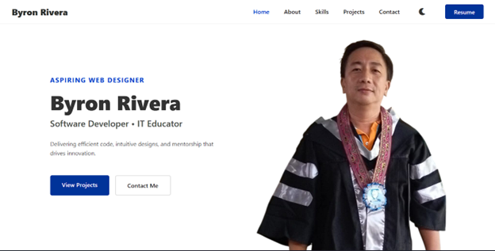

# Byron Rivera | Personal Portfolio Website

A responsive personal portfolio website showcasing my biography, technical skills, and projects. This website serves as my digital resume and demonstrates my proficiency in modern web development technologies.

## 🌐 Live Demo

[View Live Site](https://brianjay322.github.io/byronrivera)

## 📋 Project Overview

This portfolio website was developed as a final project for the **Web-Based Programming/Multimedia Systems** course. It features a clean, modern design with full responsiveness across all device sizes.

### Features

- **Hero Section** - Eye-catching introduction with call-to-action buttons
- **About Me** - Professional biography and background information
- **Skills** - Visual representation of technical skills with progress bars and professional competencies
- **Projects Gallery** - Showcase of completed projects with descriptions and links
- **Contact** - Multiple ways to get in touch including social media links

## 🛠️ Tech Stack

| Technology | Usage |
|------------|-------|
| **HTML5** | Semantic markup structure (`<header>`, `<nav>`, `<main>`, `<section>`, `<article>`, `<footer>`) |
| **CSS3** | Custom styling with modern layout techniques |
| **JavaScript** | Interactive hamburger menu for mobile navigation |
| **Font Awesome** | Icons throughout the website |
| **Git & GitHub** | Version control and repository hosting |
| **GitHub Pages** | Live site deployment |

## 🎨 CSS Approach

This project uses **Pure CSS** (no frameworks) with the following features:

- **CSS Flexbox** - Used for navigation, buttons, and component layouts
- **CSS Grid** - Used for skills grid, projects gallery, about section, and contact cards
- **CSS Variables** - Custom properties defined in `:root` for consistent theming
- **Media Queries** - Responsive breakpoints for mobile, tablet, and desktop views
